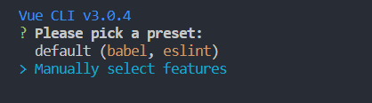
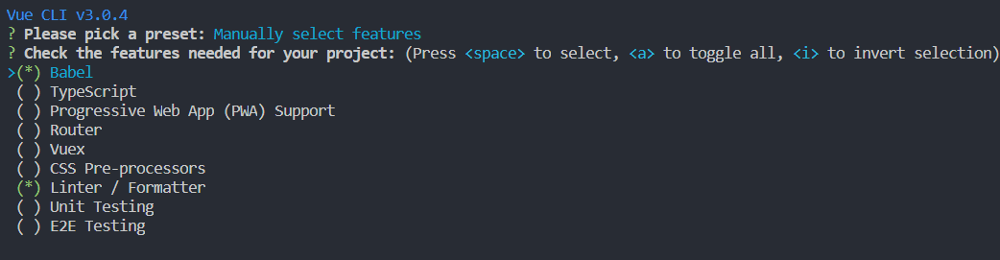
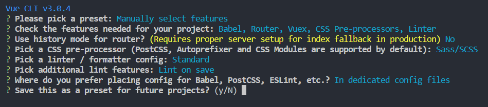

# vue-cli 3.0基本使用方式

## 全局安装@vue/cli
vue-cli是之前的包名，当你使用`npm i -g vue-cli`安装的包版本号依然还是`2.9.6`。 当前它的名字已经改成了`@vue/cli`，所以安装要换名字：
```shell
npm i -g @vue/cli
```
官方提示，如果存在旧版本，请将旧版本`vue-cli`从全局卸载，可能是命令有冲突啥的，反正卸载更安全：`npm un -g vue-cli`

## 创建项目
### 命令行窗口创建初始项目
普通的`cmd`就行，记住切到制定目录下，我使用的是`vscode`提供的`terminal`。不要使用`git bash`，上下箭头没有用
```shell
vue create vue-cli-test
```
### 选择预设
我选择手动选择选择一些功能



### 手动选择功能
上下选择，空格切换选中或不选，`i`反选

我选择了这些`Babel, Router, Vuex, CSS Pre-processors, Linter`




### 其他选项


`Save this as a preset for future projects? `这最后一个表示是否把这一路的选择保存起来(会保存到当前用户文件夹中的`.vuerc`文件中)，下次`vue create`的时候可以直接使用这些选项，我选择~~~~`No`

接下来就会根据这些选项初始化项目，慢慢等，知道天荒地老

### 项目结构
```javascript
|-- vue-cli-test
    |-- .browserslistrc
    |-- .eslintrc.js
    |-- .gitignore
    |-- babel.config.js
    |-- package-lock.json
    |-- package.json
    |-- postcss.config.js
    |-- README.md
    |-- public
    |   |-- favicon.ico
    |   |-- index.html
    |-- src
        |-- App.vue
        |-- main.js
        |-- router.js
        |-- store.js
        |-- assets
        |   |-- logo.png
        |-- components
        |   |-- HelloWorld.vue
        |-- views
            |-- About.vue
            |-- Home.vue
```

整个项目结构和`vue-cli`2还是非常相似的，最主要的应该就是没有`build`和`config`这个`webpack`配置目录了。毕竟零配置。

## vue.config.js
### vue-cli 3 中使用rem
- 安装amfe-flexible和px2rem-loader
手淘的`lib-flexible`升级成了`amfe-flexible`
```shell
npm i -S amfe-flexible px2rem-loader
```

- `src/main.js`引入`amfe-flexible`
```javascript
// main.js
import 'amfe-flexible'
```

- 配置`vue.config.js`
```javascript
// vue.config.js
module.exports = {
  // 如何在vue-cli 3 中使用px2rem: 
  // https://github.com/vuejs/vue-cli/issues/1706
  chainWebpack: config => {
    function generateLoaders (loader) {
      config.module
        .rule(loader)
        .oneOf('vue')
        .use('px2rem-loader')
        .loader('px2rem-loader')
        .before('postcss-loader')
        .options({ remUnit: 75, remPrecision: 8 })
        .end()
      config.module
        .rule(loader)
        .oneOf('normal')
        .use('px2rem-loader')
        .loader('px2rem-loader')
        // .before('postcss-loader')
        .options({ remUnit: 75, remPrecision: 8 })
        .end()
    }
    generateLoaders('css')
    generateLoaders('scss')
  }
}
```

### 如何使用scss公共模块时不用每个vue文件都引入[官方文档直达](https://cli.vuejs.org/guide/css.html#automatic-imports)
- 安装style-resources-loader
```shell
npm i -D style-resources-loader
```
- 配置`vue.config.js`
```javascript
const path = require('path')

module.exports = {
  chainWebpack: config => {

    const types = ['vue-modules', 'vue', 'normal-modules', 'normal']
    types.forEach(type => addStyleResource(config.module.rule('scss').oneOf(type)))
    function addStyleResource (rule) {
      rule.use('style-resource')
        .loader('style-resources-loader')
        .options({
          patterns: [
            path.resolve(__dirname, './src/styles/color.scss'),
          ],
        })
    }
    
  }
}
```
- 此时，每个`vue`文件就无需手动引入`./src/styles/color.scss`，就可以在其中使用`color.scss`中的变量、混合等